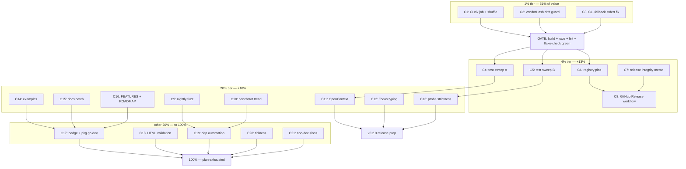

# Consolidated Roadmap & Execution Plan — 2026-08-15 22:00

**Input:** TODO_LIST.md (4 open) + section (f) of status reports
`2026-08-15_21-44` and `2026-08-15_21-53` (40 items each, heavily
overlapping) + this session's README/AGENTS audit findings. Consolidated,
deduplicated, Pareto-ranked. This file is a **point-in-time snapshot**;
TODO_LIST.md is the living source.

**Where we are:** library reviewed end-to-end (2026-08-15), two correctness
bugs fixed and regression-pinned, shipped as `v0.1.1` (= `74dd031`, pushed).
Build / race / lint / flake-check all green; 86.2% coverage; real-DB smoke
test passing. Remote tag verified this session: origin `v0.1.1` → `74dd031`,
matching local — **no retag, no proxy poisoning, nothing to do**.

**Facts shaping priority:**
- CI has no nix job — the vendorHash rot class (bit once at `16260fe`) is
  invisible to CI. Cheapest high-value infra fix.
- The CLI fallback (`crush projects --json`) parses `CombinedOutput()` as
  pure JSON; any stray log line on stdout/stderr likely breaks it. Only
  *suspected* live defect left in shipped code — verify before planning a fix.
- Test gaps cluster on rarely-exercised paths (FinishedAt, depth cap,
  non-UTC stats, tie-breaks, WAL concurrency).

---

## 1) Pareto Breakdown

### The 1% that delivers 51%
1. **CI nix job + go.sum↔vendorHash drift guard** — kills the only
   infrastructure failure class that has actually occurred. Makes every
   future dependency refresh safe by construction.
2. **CLI-fallback stderr robustness: verify, then fix** — the only suspected
   live bug in shipped behavior. One bounded experiment settles it.

### The 4% that delivers 64% (next +13%)
3. **Test-gap sweeps A+B** — pin every promised behavior that currently
   rides on hope (FinishedAt, rows.Err, hour guard, zero-table, non-UTC
   stats day, depth cap, dedupe tie, fan-out, WAL concurrency).
4. **Registry/parser pins** — `"null"` input, unreadable-registry fallback.
5. **Release workflow** — tag-driven GitHub Releases from CHANGELOG.

### The 20% that delivers 80% (next +16%)
6. **API evolution bundle (v0.2.0):** `OpenContext`, `Todos` as
   `json.RawMessage`, schema-probe strictness.
7. **Runnable examples** (`example_test.go`) + docs completeness
   (CONTRIBUTING parity warning, README tz note in Quick start, FEATURES +
   ROADMAP).
8. **Fuzz & bench become load-bearing** — nightly 60s fuzz, benchstat trend.

### The other 20% to reach 100%
9. Dependency automation (Renovate, monthly flake update).
10. Tidiness: stale lint exclusions, GOOS test, exhaustruct audit, HTML
    artifact validation, coverage badge, pkg.go.dev check.
11. Conscious non-decisions recorded (DOMAIN_LANGUAGE skip, AgentGraph CTE
    only-if-hot).

**Process rules (no repo task):** re-verify state at report time; restart
LSP after mid-session deletes; append CHANGELOG under `[Unreleased]` unless
tag state is verified; use `mktemp -d` for scratch dirs.

---

## 2) Coarse Plan — tasks of 30–100 min (ALL TODOs included)

| ID | Task | Impact | Effort | Tier |
|----|------|--------|--------|------|
| C1 | CI: add `nix flake check` job + `go test -shuffle=on` | Prevents silent flake rot | 60m | 1% |
| C2 | go.sum↔vendorHash drift guard (CI step + script) | Kills known failure class | 45m | 1% |
| C3 | Verify & harden CLI-fallback stderr parsing | Only suspected live bug | 60m | 1% |
| C4 | Test sweep A: row paths (FinishedAt, rows.Err, hour guard, zero-table) | Hardens promises | 90m | 4% |
| C5 | Test sweep B: filter/graph paths (non-UTC stats, depth cap, dedupe tie, fan-out, WAL concurrency) | Hardens promises | 100m | 4% |
| C6 | Registry/parser pins (`"null"`, chmod-000 fallback) | Edge-case correctness | 40m | 4% |
| C7 | Release integrity: document ls-remote result, record v0.1.2 decision | Trust | 30m | 4% |
| C8 | Tag-driven GitHub Release workflow (CHANGELOG → notes) | Release hygiene | 60m | 4% |
| C9 | Nightly fuzz job + one real 60s local run | Deep robustness | 45m | 20% |
| C10 | Benchstat trend artifact (baseline + CI compare) | Perf visibility | 50m | 20% |
| C11 | API: `OpenContext(ctx, dir)` + `Open` delegating + cancel tests | API completeness | 90m | 20% |
| C12 | API: `Session.Todos` → `json.RawMessage` (+CHANGELOG break note) | Type honesty | 60m | 20% |
| C13 | Schema-probe strictness (surface probe errors) | Correctness | 100m | 20% |
| C14 | `example_test.go`: Discover, Messages type-switch, Stats | Docs quality | 60m | 20% |
| C15 | Docs batch: README tz note in Quick start, CONTRIBUTING parity warning + re-read, link check | Docs quality | 45m | 20% |
| C16 | FEATURES.md + ROADMAP.md (docs-health BUILD) | Repo navigation | 90m | 20% |
| C17 | Coverage badge + pkg.go.dev verification | Polish | 30m | 80% |
| C18 | HTML artifact render validation (2 files) | Artifact integrity | 20m | 80% |
| C19 | Dependency automation: Renovate config + monthly flake-update workflow | Maintenance | 60m | 80% |
| C20 | Tidiness: unused-exclusion re-eval, windowsLocalAppData test, exhaustruct audit | Hygiene | 45m | 80% |
| C21 | Record non-decisions (DOMAIN_LANGUAGE skip, CTE-if-hot) in ROADMAP | Anti-drift | 12m | 80% |

Sorted by importance/impact: C1 → C2 → C3 → C4 → C5 → C6 → C7 → C8 →
C11 → C13 → C12 → C14 → C9 → C10 → C15 → C16 → C19 → C17 → C20 → C18 → C21.
Customer-value note: this is a public library; "customer" = downstream Go
developers (crush-daily, mindwalk) — API work (C11–C13) and CI honesty
(C1–C2) are their highest-value items.

---

## 3) Fine Plan — every task ≤ 12 min (ALL TODOs included)

| ID | Task (atomic) | Parent | Est |
|----|----------------|--------|-----|
| F1 | Write CI job: nix-installer + `nix flake check` | C1 | 12m |
| F2 | Add `-shuffle=on` to CI test step | C1 | 2m |
| F3 | Run `actionlint` on changed workflow | C1 | 5m |
| F4 | Write `scripts/check-vendor-hash.sh` (go.sum hash vs flake) | C2 | 12m |
| F5 | Wire guard as CI step after test job | C2 | 6m |
| F6 | Tamper go.sum locally, prove guard fires, revert | C2 | 8m |
| F7 | Write failing test: fake CLI emitting log noise + JSON on stderr | C3 | 12m |
| F8 | Run it; record confirmed/debunked | C3 | 3m |
| F9 | If confirmed: extract JSON substring before Unmarshal | C3 | 12m |
| F10 | Regression tests: pure JSON + noisy cases | C3 | 10m |
| F11 | Test FinishedAt populated (non-null) path | C4 | 10m |
| F12 | Test collectRows rows.Err() branch (cancel mid-iterate) | C4 | 12m |
| F13 | Test hour-histogram out-of-range guard | C4 | 8m |
| F14 | Explicit zero-table SQLite open test | C4 | 6m |
| F15 | Test Stats day filter in non-UTC zone | C5 | 10m |
| F16 | Test ErrGraphDepthExceeded (65-deep chain) | C5 | 12m |
| F17 | Test dedupe tie-break (equal LastAccessed keeps first) | C5 | 8m |
| F18 | 100-children fan-out graph stress | C5 | 10m |
| F19 | Concurrent read vs WAL writer integration test | C5 | 12m |
| F20 | Pin ParseProjectsOutput("null") behavior | C6 | 6m |
| F21 | Test chmod-000 registry → CLI fallback (skip as root) | C6 | 10m |
| F22 | Document ls-remote tag verification in C7 memo | C7 | 5m |
| F23 | Record v0.1.2 decision (default: not needed) | C7 | 5m |
| F24 | Release workflow yml (extract section from CHANGELOG) | C8 | 12m |
| F25 | actionlint + workflow_ref review | C8 | 8m |
| F26 | Verify workflow on next real release (checklist note) | C8 | 4m |
| F27 | Local `go test -fuzz FuzzDecodeParts -fuzztime 60s`; triage | C9 | 12m |
| F28 | Nightly fuzz workflow (continue-on-crash, artifact logs) | C9 | 12m |
| F29 | Add any crasher as seed corpus + fix | C9 | 12m |
| F30 | Run BenchmarkSessionsList, store baseline artifact | C10 | 8m |
| F31 | Add benchstat to devShell | C10 | 5m |
| F32 | CI job: bench vs baseline artifact, post diff | C10 | 12m |
| F33 | Design OpenContext signature + delegation contract | C11 | 8m |
| F34 | Implement OpenContext; Open delegates | C11 | 12m |
| F35 | Tests: cancel during open, happy path parity | C11 | 12m |
| F36 | CHANGELOG + README godoc touchpoints | C11 | 8m |
| F37 | Switch Todos to json.RawMessage | C12 | 10m |
| F38 | Fix compile/tests; assert raw pass-through | C12 | 10m |
| F39 | CHANGELOG breaking-change note under v0.2.0 | C12 | 6m |
| F40 | Write strictness decision memo (options + pick) | C13 | 12m |
| F41 | Surface probe errors from Open | C13 | 12m |
| F42 | Tests: broken DB ≠ legacy schema | C13 | 12m |
| F43 | Update doc.go/schema.go docs | C13 | 8m |
| F44 | Example: Discover + Open + Sessions | C14 | 12m |
| F45 | Example: Messages parts type-switch | C14 | 10m |
| F46 | Example: Stats day report | C14 | 10m |
| F47 | Verify testableexamples passes | C14 | 4m |
| F48 | README Quick start: timezone comment line | C15 | 5m |
| F49 | CONTRIBUTING: parity-contract warning block | C15 | 8m |
| F50 | Mechanical link/anchor check README | C15 | 10m |
| F51 | CONTRIBUTING re-read vs current state | C15 | 10m |
| F52 | FEATURES.md via docs-health BUILD | C16 | 12m |
| F53 | ROADMAP.md via docs-health BUILD | C16 | 12m |
| F54 | Cross-link both from README | C16 | 6m |
| F55 | Coverage badge (needs CI artifact) | C17 | 10m |
| F56 | pkg.go.dev check after proxy crawl | C17 | 6m |
| F57 | Structural validation of 2 HTML artifacts | C18 | 10m |
| F58 | renovate.json (gomod + flake lock) | C19 | 12m |
| F59 | Monthly flake-update workflow | C19 | 12m |
| F60 | Validate configs parse (renovate-config-validator) | C19 | 8m |
| F61 | Re-evaluate `_test.go` unused exclusion; remove if stale | C20 | 10m |
| F62 | windowsLocalAppData GOOS-gated test | C20 | 10m |
| F63 | exhaustruct exclusion audit | C20 | 8m |
| F64 | ROADMAP: record DOMAIN_LANGUAGE skip rationale | C21 | 6m |
| F65 | ROADMAP: record CTE-if-hot condition | C21 | 6m |

Execution order within each tier follows the coarse ordering; F-tasks of
one C-task complete before the next C-task starts (except C1/C2 which can
interleave — independent files).

---

## 4) Execution Graph

**Gates:** every tier ends green on `go build ./... && go test -race ./...
&& golangci-lint run ./... && nix flake check`. No tier starts while red.

---

## 5) Explicit non-goals (anti-Verschlimmbesserung)

- No rewrite of stats SQL — parity contract (`TestStatsParityWithCrushDailySQL`)
  is law; C13 touches error paths only.
- No AgentGraph CTE rewrite unless a consumer measures it hot.
- No new dependencies; no DTO layers; no config surface for a read-only library.
- No DOMAIN_LANGUAGE.md at this size — decision recorded in ROADMAP instead.

*Snapshot generated 2026-08-15 22:00. Living tasks: TODO_LIST.md.*
