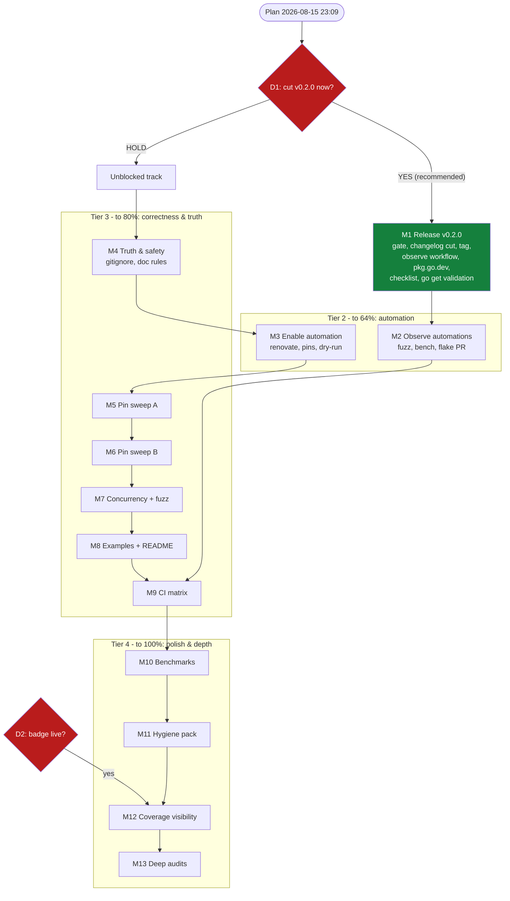

# Pareto Execution Plan — Ship v0.2.0 & Harden, 2026-08-15 23:09

**Input state:** TODO_LIST.md (~45 open items) + 7 audit findings from
`docs/status/archived/2026-08-15_23-04_closure-pass-and-daemon-commit-audit.md`
(harvested into TODO_LIST this session). Head `88012fe`, tree clean,
origin/master in sync. All 21 roadmap tasks (C1–C21) done and gate-green;
**87.8%** statement coverage; final canonical gate green twice.

**Customers of this repo:** downstream consumers (crush-daily, the mindwalk
fork), future pkg.go.dev users, and the maintainer's future agent sessions.
Value lens below = downstream-user value first, self-maintenance second,
internal polish last.

**Two decision gates pending (user):**
- **D1 — cut v0.2.0 now?** RECOMMENDED: yes. `[Unreleased]` holds a breaking
  change (`Session.Todos` → `json.RawMessage`) plus `OpenContext` and probe
  strictness. Consumers must migrate either way; the tag also gives the
  release workflow its first real run.
- **D2 — coverage badge static or live?** Static shipped; live ≈ 30m.

## Guardrails (VERSCHLIMMBESSER protection — read before executing anything)

1. **Parity is law:** never touch stats SQL; `TestStatsParityWithCrushDailySQL`
   is the contract.
2. **No new dependencies** (recorded non-decision in ROADMAP.md).
3. **No public API additions** beyond what is already staged — this plan
   ships and hardens, it does not grow surface.
4. **Every gate:** `set -o pipefail; go build ./... && go vet ./... &&
   go test -race -shuffle=on ./... && nix run .#lint && nix flake check &&
   nix develop --command actionlint`.
5. **Verify-then-annotate:** no "done/green" in any doc before the command
   exits 0 in the same session.
6. Pin tests may only PIN documented behavior — if a pin contradicts a doc,
   fix the doc or surface the discrepancy, never silently change semantics.

---

## Step 1 — Pareto Breakdown

### The 1% that delivers 51% — CUT v0.2.0 (D1)

One action ships every staged API change to both downstream consumers,
triggers the release workflow's first real run, and makes the new API
discoverable on pkg.go.dev. Everything else in this repo is worth ~nothing
to consumers until this lands. **Blocked only on D1.**

### The 4% that delivers 64% — automation observability & enablement

+ Renovate app install, observe first fuzz/bench/flake-update runs, pin
  benchstat + golangci-lint versions, workflow_dispatch dry-run. After this
  the repo catches its own drift; no human session is the only line of
  defense.

### The 20% that delivers 80% — correctness pins & truth fixes

+ The two test-pin sweeps, WAL concurrency for `Messages`, fuzz
  `loadRegistry`, `.crush/` repo gitignore, daemon-commit reliability docs,
  README API bullets, runnable examples, CI matrix legs. This is the
  insurance on the library's entire value proposition: correct, documented,
  provable behavior.

### The other 20% (to 100%) — polish & depth

Benchmark expansion, CODEOWNERS/SECURITY.md, coverage artifact/live badge,
deep audits (daemon messages, gosec G701 upstream, nolint sweep, darwin
path audit, cadence dedup), ongoing fuzz-corpus mining.

**Out of scope (ROADMAP ideas, need a 2nd consumer first):** `DecodeTodos`
helper, streaming message iterator, registry watching.

---

## Step 2 — Comprehensive Plan (medium tasks, 30–100min each)

Sorted by importance → impact → effort → customer value. "When" = what
unblocks it.

| # | Task | Tier | Impact | Effort | Customer value | When | Status |
|---|------|------|--------|--------|----------------|------|--------|
| M1 | **v0.2.0 release cut**: final gate, CHANGELOG section cut, annotated tag, observe release workflow, pkg.go.dev verify, RELEASING checklist, clean-module `go get` validation | 1%→51% | MAX | 60m | Ships the API consumers must migrate to | **D1 (user)** | done `6948933` (tag, Release, proxy, `go get` all verified; pkg.go.dev re-check pending — TODO_LIST) |
| M4 | **Truth & safety fixes**: `.crush/` repo gitignore, RELEASING daemon-reliability note, AGENTS verify-then-annotate + diff-daemon-commits rules, CHANGELOG doc-only policy, LSP ghost clearance | 20% | HIGH | 30m | Prevents real-DB leak in public repo; stops lying history from misleading | now | done `232ff1f` |
| M3 | **Automation enablement**: Renovate app install, pin benchstat in bench.yml, golangci-lint via go.mod `tool` directive, release workflow_dispatch dry-run | 4% | HIGH | 35m | Repo becomes self-maintaining | now | done `0778b21` — except m3.1 (app install, external — TODO_LIST) |
| M5 | **Test-pin sweep A (sessions/discover)**: Session(byID) not-found, Day+Limit composition, dedupe zero-timestamp, DiscoverProjects ordering, ReadFiles empty-path, Models/Providers ordering doc+pin | 20% | HIGH | 60m | Proves documented behavior downstream relies on | now | done `770b69d` |
| M6 | **Test-pin sweep B (legacy/CLI)**: legacy NULL substitution, stats-day legacy combo, real-DB capability asserts, CLI exit-nonzero+partial-JSON, extractJSONObject brace-in-string edge | 20% | HIGH | 60m | Same, for the legacy/migration paths | now | done `dd64a2d` (m6.5 doc-comment correction completed 2026-08-16) |
| M7 | **Concurrency + fuzz expansion**: WAL `Messages` concurrent readers, fuzz `loadRegistry` target, first corpus mining pass | 20% | MED-HIGH | 45m | Race safety + parser hardening | now | done `0822d70` — except m7.3 (corpus mining, ongoing — TODO_LIST) |
| M8 | **Examples + README API surface**: ExampleAgentGraph, ExampleReadFiles (Output blocks), README Design bullets for OpenContext + Todos | 20% | MED-HIGH | 50m | pkg.go.dev visitors see the new API used | now | done `eabdcb1` |
| M9 | **CI matrix legs**: windows-latest + macos-latest, platform fallout fixes | 20% | MED | 45m | Real-Windows `windowsLocalAppData` coverage | now | done `79c9720` + fixes `c3a083b`, `c7482e2`. **Windows fallout:** v0.2.0 was tagged before the matrix went green, so the immutable tag has a red Windows leg (test code only) — v0.2.1 decision in TODO_LIST; rule encoded in RELEASING.md precondition 4 |
| M2 | **Observe automations**: nightly fuzz run, bench-trend run, flake-update PR; record observations in FEATURES (PARTIALLY→FULLY_FUNCTIONAL) | 4% | MED | 30m | Trust in shipped workflows | after schedules fire / post-M1 | partial — bench observed green; nightly fuzz + flake-update first runs pending (TODO_LIST) |
| M10 | **Benchmark expansion**: BenchmarkMessages, BenchmarkAgentGraph, baseline regen | 4%→polish | MED | 35m | Trend depth beyond Sessions | now | done `581658b` |
| M11 | **Hygiene pack**: CODEOWNERS, SECURITY.md, CONTRIBUTING benchstat fallback note, `-count=2` race command | polish | MED | 30m | Public-repo credibility | now | done `80d1b34` |
| M12 | **Coverage visibility**: CI cover HTML artifact (+ live badge if D2) | polish | MED | 30m | Honest quality signal | now / **D2** | done `754d32c`; m12.2 live badge **Won't implement** (D2: static kept — ROADMAP non-decision) |
| M13 | **Deep audits**: daemon messages vs diffs, gosec G701 upstream repro, nolint sweep, nix-vs-Renovate cadence, darwin global-dir audit | polish | LOW-MED | 60m | History reliability, upstream hygiene | now | done `f679a90` — except m13.2 (gosec upstream, deferred — TODO_LIST) |

All 52 open TODO items map into M1–M13 (mapping table in Step 3). No orphans.

---

## Step 3 — Micro Breakdown (all tasks ≤12min, grouped by medium task)

Execution order within groups follows the table above; `→ GATE` items are
the canonical gate run for that group.

### M1 — v0.2.0 release (60m total) — on D1

| ID | Task | Min |
|----|------|-----|
| m1.1 | Re-run canonical gate on a clean tree; confirm 0 issues | 10 |
| m1.2 | CHANGELOG: cut `[Unreleased]` → `## [0.2.0] 2026-08-16` (keep breaking-change callout first) | 10 |
| m1.3 | Annotated tag `v0.2.0` (`git tag -a`), push tag; verify `ls-remote` shows it once | 5 |
| m1.4 | Observe release workflow run end-to-end; verify notes + artifacts | 10 |
| m1.5 | Verify pkg.go.dev crawled v0.2.0; spot-check OpenContext/Todos render | 10 |
| m1.6 | Tick RELEASING.md first-run checklist; sync TODO_LIST/FEATURES rows | 10 |
| m1.7 | Clean temp module: `go get github.com/LarsArtmann/go-crush-data@v0.2.0` compiles | 10 |

### M4 — truth & safety (30m) — now

| ID | Task | Min |
|----|------|-----|
| m4.1 | `.gitignore`: add `.crush/` (repo-level; global one stays) | 2 |
| m4.2 | RELEASING.md: daemon-commit unreliability note (CHANGELOG = truth) | 5 |
| m4.3 | AGENTS.md: verify-then-annotate rule | 5 |
| m4.4 | AGENTS.md: diff-daemon-commits rule | 5 |
| m4.5 | CHANGELOG policy: doc-only changes not changelogged — decide + write line | 5 |
| m4.6 | LSP ghost clearance (restart, confirm golangci_lint_ls clean) | 5 |

### M3 — automation enablement (35m) — now

| ID | Task | Min |
|----|------|-----|
| m3.1 | Install/enable Renovate app on the repo (GitHub settings) | 5 |
| m3.2 | bench.yml: pin benchstat module version (drop `@latest`) | 10 |
| m3.3 | CI: golangci-lint via go.mod `tool` directive (replaces `go install @v2.12.2`) | 12 |
| m3.4 | release.yml: `workflow_dispatch` dry-run input (skip publish step) | 10 |

### M5 — pin sweep A (60m) — now

| ID | Task | Min |
|----|------|-----|
| m5.1 | Pin `Session(byID)` miss → `ErrSessionNotFound` (if uncovered) | 5 |
| m5.2 | Pin `Day + Limit` filter composition | 10 |
| m5.3 | Pin `dedupeProjects` zero-timestamp sorts-last claim | 10 |
| m5.4 | Pin `DiscoverProjects` result ordering (sorted by DataDir) | 5 |
| m5.5 | Pin `ReadFiles` empty-path filtering | 10 |
| m5.6 | Document + pin `Models`/`Providers` DISTINCT ordering | 10 |
| m5.7 | → GATE | 10 |

### M6 — pin sweep B (60m) — now

| ID | Task | Min |
|----|------|-----|
| m6.1 | Pin messages legacy-schema NULL substitution (model/provider/finished) | 10 |
| m6.2 | Stats day filter × legacy schema combo test | 10 |
| m6.3 | `TestSessionsOnRealDatabase`: assert capabilities explicitly | 10 |
| m6.4 | CLI-fallback: exit-nonzero + partial JSON → error-path pin | 10 |
| m6.5 | `extractJSONObject`: brace-inside-string edge (document or handle) | 12 |
| m6.6 | → GATE | 10 |

### M7 — concurrency + fuzz (45m) — now

| ID | Task | Min |
|----|------|-----|
| m7.1 | WAL concurrency test exercising `Messages` (pattern exists for Sessions) | 12 |
| m7.2 | Fuzz target: `loadRegistry` JSON shape | 12 |
| m7.3 | First corpus-mining pass over nightly fuzz artifacts | 12 |
| m7.4 | → GATE | 10 |

### M8 — examples + README (50m) — now

| ID | Task | Min |
|----|------|-----|
| m8.1 | README Design bullets: `OpenContext` + `Todos` raw JSON | 10 |
| m8.2 | `ExampleAgentGraph` with `// Output:` block | 20 |
| m8.3 | `ExampleReadFiles` with `// Output:` block | 15 |
| m8.4 | → GATE | 5 |

### M9 — CI matrix (45m) — now

| ID | Task | Min |
|----|------|-----|
| m9.1 | Add windows-latest leg to test job | 15 |
| m9.2 | Add macos-latest leg | 10 |
| m9.3 | Fix platform fallout (vendorHash script, path handling) | 15 |
| m9.4 | Observe matrix runs green on origin | 5 |

### M2 — observe automations (30m) — post-schedule/post-M1

| ID | Task | Min |
|----|------|-----|
| m2.1 | Observe nightly fuzz run (03:17 UTC); record result | 10 |
| m2.2 | Observe bench-trend run; sanity-check step-summary render | 10 |
| m2.3 | Observe first flake-update PR; review vendorHash guard behavior | 10 |

### M10 — benchmarks (35m) — now

| ID | Task | Min |
|----|------|-----|
| m10.1 | Add `BenchmarkMessages` | 15 |
| m10.2 | Add `BenchmarkAgentGraph` | 15 |
| m10.3 | Regenerate baseline; benchstat parses it | 5 |

### M11 — hygiene pack (30m) — now

| ID | Task | Min |
|----|------|-----|
| m11.1 | CODEOWNERS file | 5 |
| m11.2 | SECURITY.md (reporting policy) | 12 |
| m11.3 | CONTRIBUTING: `go run benchstat@latest` fallback note | 5 |
| m11.4 | AGENTS.md: add `-count=2` to local race command | 2 |
| m11.5 | → GATE | 5 |

### M12 — coverage visibility (30m) — now / D2

| ID | Task | Min |
|----|------|-----|
| m12.1 | CI: upload `cover -html` artifact next to the 85% gate | 10 |
| m12.2 | Live badge (codecov or artifact JSON) — only if D2 says live | 20 |

### M13 — deep audits (60m) — now, lowest urgency

| ID | Task | Min |
|----|------|-----|
| m13.1 | Audit daemon commit messages vs diffs; note reliability | 15 |
| m13.2 | gosec G701: minimal upstream repro (first pass) | 12 |
| m13.3 | `//nolint` staleness sweep | 12 |
| m13.4 | Decide nix `flake update` vs Renovate nix manager overlap | 10 |
| m13.5 | Darwin global-dir handling audit (upstream parity) | 10 |

**Totals:** 60 micro tasks, 13 medium tasks, ~10.5h. Every open TODO item
from TODO_LIST.md (incl. the 7 audit findings) appears exactly once.

**Micro-task resolution (2026-08-16):** all m-tasks landed with their M-task
commit except: m2.1/m2.3 (scheduled runs not yet fired — TODO_LIST), m3.1
(Renovate app — external), m7.3 (corpus mining — needs first artifacts),
m12.2 (live badge — **Won't implement** per D2), m13.2 (gosec upstream —
deferred, TODO_LIST), and m9.4 (matrix-green was observed only AFTER two
Windows fix rounds — the v0.2.0 tag had already been cut; lesson encoded in
RELEASING.md precondition 4, v0.2.1 decision in TODO_LIST).

---

## Execution graph

Read as priority order, not hard dependencies: within T3/T4 groups run
sequentially with a gate after each medium task; M2 needs the schedules to
have fired (nightly fuzz 03:17 UTC); M12.2 needs D2.

---

## Mapping: TODO_LIST item → medium task

| TODO_LIST section | → |
|---|---|
| Pending user decisions (v0.2.0, badge) | M1, M12 (D1, D2 gates) |
| High — truth & safety (7 items) | M4, M12.1, M13.1 |
| High — release & automation observability (5) | M2, M3.1 |
| Medium — hardening new surfaces (7) | M3, M9, M10, M12 |
| Medium — test pins (16) | M5, M6, M7, M8 |
| Low — polish (8) | M11, M13 |
| ROADMAP raw ideas (3) | out of scope (need 2nd consumer) |
