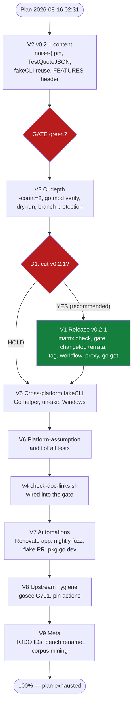

# Pareto Execution Plan — v0.2.1 Cut, Windows Truth & Mechanized Docs, 2026-08-16 02:31

> **Executed 2026-08-16 (same day).** V2 → V3 → D1(YES) → V1 → V5 → V6 → V4
> → V9 all landed; every push watched to green on all four CI jobs.
> v0.2.1 is tagged at `7ff9e72` (all-platform-green, erratum included).
> Branch protection (v3.5) was declined by the user — recorded as a
> non-decision in ROADMAP.md. Two findings surfaced beyond the plan:
> gosec's taint findings fire non-deterministically on the windows runner,
> so the eight //nolint:gosec directives moved to config-level exclusions
> (`887c936`); and V5's un-skip immediately exposed the POSIX-only
> chmod-000 premise the old skip had masked (`63ad9a7`) — the plan's
> predicted fallout class, caught the same day. Remaining open items are
> external/schedule-gated (T1–T7 in TODO_LIST.md).

**Input state:** TODO_LIST.md (21 open items after the 2026-08-16 docs-health
audit rebuilt it) + the audit session's findings
(`docs/status/2026-08-16_02-13_docs-health-audit-annotate-archive.md`).
Head `4b8b1b3`, tree clean modulo this plan, master ahead 2 of origin.
All living docs verified fresh against code/git/CI by the audit; gate green
(build, vet, race+shuffle, lint 0, flake check, actionlint, real-DB smoke).

**Customers of this repo:** downstream consumers (crush-daily, the mindwalk
fork), pkg.go.dev visitors, the maintainer's future agent sessions. Value
lens below = downstream-consumer trust first, self-maintenance second,
internal polish last.

**One decision gate pending (user):**

- **D1 — cut v0.2.1 now?** RECOMMENDED: yes. Master is CI-green on all three
  matrix legs (verified on `c7482e2` and re-verified during the audit); the
  immutable v0.2.0 tag is Windows-red forever (test code only — `quoteJSON`
  escaping, `/bin/sh` fake CLIs; the library itself is correct). A v0.2.1
  with fixes-only + an errata note gives consumers a tag whose tests pass on
  every platform. RELEASING.md precondition 4 (CI green on all legs before
  tagging) exists precisely for this and is satisfiable right now. Requires
  tag-push approval — pushing commits does not authorize pushing tags.

## Guardrails (VERSCHLIMMBESSERUNG protection — read before executing anything)

1. **Parity is law:** never touch stats SQL;
   `TestStatsParityWithCrushDailySQL` is the contract.
2. **No new dependencies** (recorded non-decision in ROADMAP.md).
3. **v0.2.1 is fixes-only:** no API surface changes, no behavior changes —
   tests, CI, docs, and the errata note. Consumers must be able to bump the
   patch version blindly.
4. **Every gate:** `set -o pipefail; go build ./... && go vet ./... &&
   go test -race -shuffle=on ./... && nix run .#lint && nix flake check &&
   nix develop --command actionlint`.
5. **Verify-then-annotate:** no "done/green" in any doc before the command
   exited 0 in the same session. The 2026-08-16 audit found this exact
   violation pattern twice in one day — it is the repo's #1 truth risk.
6. **Tags need explicit approval** (D1). Never push a tag on commit-push
   authorization alone; the v0.2.0 poisoned tag is the standing example.
7. Pin tests may only PIN documented behavior — if a pin contradicts a doc,
   fix the doc or surface the discrepancy, never silently change semantics.

---

## Step 1 — Pareto Breakdown

### The 1% that delivers 51% — CUT v0.2.1 (D1)

One action closes the highest-trust gap in the repo: the v0.2.0 tag is
permanently Windows-red and FEATURES/TODO_LIST carry that caveat. Cutting
v0.2.1 (fixes `c3a083b` + `c7482e2` + the V2 regression pins + errata note)
gives consumers an all-platform-green tag, retires the standing caveat
across three docs, and exercises the hardened RELEASING preconditions for
real. Everything else is worth little to consumers until this lands.
**Blocked only on D1.**

### The 4% that delivers 64% — make the tag trustworthy and CI self-defending

+ **V2 — fold the missing regression pins into v0.2.1**: `}`-in-noise-after-JSON
  error-path pin, `TestQuoteJSON` backslash-escape pin, fakeCLI reuse in the
  exit-nonzero test, FEATURES temporal-header cleanup. These are the guards
  for exactly the bugs that poisoned v0.2.0.
+ **V3 — CI depth**: `-count=2`, `go mod verify`, one real release-dry-run
  trigger, branch protection with required status checks. After this, a red
  tag cannot be cut (precondition 4 + required checks) and a stale module
  cache cannot pass.

### The 20% that delivers 80% — real Windows coverage, self-maintenance, mechanized truth

+ **V5 — cross-platform fakeCLI** (Go-compiled helper instead of `/bin/sh`
  scripts): the CLI-fallback tests RUN on Windows instead of skipping —
  the skip is what hid the v0.2.0 breakage until a tagged release.
+ **V6 — platform-assumption audit** across all tests (`/bin/sh`, chmod,
  hardcoded unix paths): kills the fallout class at its source.
+ **V4 — `scripts/check-doc-links.sh` in the gate**: the docs drift the
  2026-08-16 audit fixed by hand (broken `[0.2.0]` link ref, stale
  `file:line` citations) becomes mechanically impossible.
+ **V7 — enable & observe automations**: Renovate app install, first nightly
  fuzz observation, first flake-update PR, pkg.go.dev v0.2.1 render check.
  After this the repo catches its own drift; FEATURES rows go
  PARTIALLY → FULLY_FUNCTIONAL.

### The other 20% (to 100%) — polish & depth

+ **V8 — upstream hygiene**: gosec G701 minimal repro + issue
  (verify-before-filing), pin GitHub action versions via Renovate.
+ **V9 — meta-maintenance**: stable TODO_LIST IDs (annotation precision),
  bench-baseline rename (it holds three benchmarks now), first fuzz
  corpus-mining pass.

**Out of scope (ROADMAP non-decisions — do not re-litigate):** AgentGraph
CTE, live coverage badge, `DecodeTodos` helper, streaming iterator,
registry watching, DOMAIN_LANGUAGE.md.

---

## Step 2 — Comprehensive Plan (medium tasks, 30–100min each)

Sorted by importance → impact → effort → customer value. "When" = what
unblocks it. **21 TODO items → 9 medium tasks, no orphans.**

| # | Task | Tier | Impact | Effort | Customer value | When |
|---|------|------|--------|--------|----------------|------|
| V1 | **v0.2.1 release cut**: verify matrix green on origin, full gate, CHANGELOG `[0.2.1]` fixes-only + v0.2.0-Windows errata, annotated tag, observe Release workflow, proxy + `go get` validation, checklist sync | 1%→51% | MAX | 60m | Consumers get an all-platform-green tag; standing caveat retired | **D1 (user)** + V2 |
| V2 | **v0.2.1 content**: `}`-in-noise-after-JSON pin, `TestQuoteJSON`, fakeCLI reuse in exit-nonzero test, FEATURES header cleanup | 4% | HIGH | 30m | The tag carries the regression guards for the v0.2.0 bug class | now |
| V3 | **CI depth**: `-count=2`, `go mod verify`, release dry-run trigger, branch protection + required checks | 4% | HIGH | 30m | Red tags structurally impossible; stale cache cannot pass | now |
| V5 | **Cross-platform fakeCLI**: Go-compiled helper replaces `/bin/sh` scripts; un-skip Windows CLI tests | 20% | HIGH | 60m | Windows actually exercises the CLI fallback (today: skip) | now |
| V6 | **Platform-assumption audit**: sweep all tests for `/bin/sh`, chmod, unix-path assumptions; fix or guard | 20% | MED-HIGH | 40m | Kills the v0.2.0-fallout class at the source | post-V5 |
| V4 | **Mechanized docs truth**: `scripts/check-doc-links.sh` (links + `file:line` citations), fix findings, wire into gate | 20% | MED-HIGH | 40m | Docs drift caught by CI, not by hero sessions | now |
| V7 | **Enable & observe automations**: Renovate app, nightly fuzz observation, flake-update PR observation, pkg.go.dev v0.2.1 check | 20%→80% | MED | 40m | Repo self-maintaining; FEATURES statuses finalize | external/schedule; post-V1 |
| V8 | **Upstream hygiene**: gosec G701 minimal repro + issue, pin action versions | polish | LOW-MED | 60m | Upstream goodwill; supply-chain pins | post-V7 (app) |
| V9 | **Meta-maintenance**: TODO_LIST stable IDs, bench-baseline rename, first corpus-mining pass | polish | LOW | 30m | Annotation precision; trend clarity | now |

**Totals: 9 medium tasks, ~5.7h** (excluding external/schedule waits).

---

## Step 3 — Micro Breakdown (all tasks ≤12min, grouped by medium task)

Execution order within groups follows Step 2; `→ GATE` items are the
canonical gate run for that group (or the relevant subset when only tests
changed).

### V2 — v0.2.1 content (30m) — now, first

| ID | Task | Min |
|----|------|-----|
| v2.1 | `TestParseProjectsOutput`: add `}` in noise AFTER the JSON payload — pin the decode-error path (documents the corrected `extractJSONObject` limitation) | 10 |
| v2.2 | `TestQuoteJSON`: pin backslash escaping (regression guard for the Windows example fix) | 10 |
| v2.3 | Reuse `fakeCLI` in `TestDiscoverProjectsCLIExitNonzeroWithPartialJSON`; drop its hand-rolled script | 10 |
| v2.4 | FEATURES.md: drop the temporal "Generated 2026-08-15" header line | 2 |
| v2.5 | → GATE | 10 |

### V1 — v0.2.1 release (60m) — on D1, after V2

| ID | Task | Min |
|----|------|-----|
| v1.1 | Verify all three CI matrix legs green on origin for HEAD (RELEASING precondition 4) | 5 |
| v1.2 | Full canonical gate on a clean tree; confirm 0 lint issues | 10 |
| v1.3 | CHANGELOG: cut `[Unreleased]` → `## [0.2.1]` — fixes-only (Windows test suite: quoteJSON escaping, shell: bash, CLI test skips, + V2 pins) + v0.2.0-Windows-tests errata note | 10 |
| v1.4 | Annotated tag `v0.2.1`, push tag, verify `ls-remote` shows it once | 5 |
| v1.5 | Observe Release workflow end-to-end; verify notes + artifacts | 10 |
| v1.6 | Verify proxy serves v0.2.1; temp-module `go get` compiles | 10 |
| v1.7 | Tick RELEASING checklist; sync TODO_LIST/FEATURES rows (retire the tag caveat) | 10 |

### V3 — CI depth (30m) — now

| ID | Task | Min |
|----|------|-----|
| v3.1 | CI test step: add `-count=2` | 2 |
| v3.2 | CI: add `go mod verify` step | 5 |
| v3.3 | actionlint over changed workflows | 5 |
| v3.4 | Trigger release `workflow_dispatch` dry_run once; inspect notes artifact | 5 |
| v3.5 | GitHub settings: protect master + require CI status checks | 5 |
| v3.6 | → GATE | 5 |

### V5 — cross-platform fakeCLI (60m) — now

| ID | Task | Min |
|----|------|-----|
| v5.1 | Decide strategy: `go build` a tiny test helper (testdata main) vs `os.Executable` self-exec trick; write the decision as a code comment | 10 |
| v5.2 | Implement the helper in testutil | 12 |
| v5.3 | Convert CLI-fallback happy-path tests to the helper | 12 |
| v5.4 | Convert the exit-nonzero test (already DRY'd by v2.3 — now cross-platform too) | 10 |
| v5.5 | Remove the Windows skips; confirm green incl. windows-latest leg | 5 |
| v5.6 | → GATE | 10 |

### V6 — platform-assumption audit (40m) — post-V5

| ID | Task | Min |
|----|------|-----|
| v6.1 | Sweep all tests: `/bin/sh`, `#!/bin`, chmod/permissions, hardcoded `/tmp` & unix paths, LF/CRLF assumptions | 10 |
| v6.2 | Fix findings or add explicit `runtime.GOOS` guards with rationale | 12 |
| v6.3 | Record the POSIX-assumption policy in AGENTS.md tooling gotchas (extends the existing Windows entry) | 5 |
| v6.4 | → GATE | 5 |

### V4 — mechanized docs truth (40m) — now

| ID | Task | Min |
|----|------|-----|
| v4.1 | Write `scripts/check-doc-links.sh`: every markdown link target exists (files, anchors optional) | 12 |
| v4.2 | Extend: `file:line` citations in FEATURES/TODO_LIST resolve to real files | 12 |
| v4.3 | Run against the repo; fix every finding | 12 |
| v4.4 | Wire into the canonical gate; document in AGENTS.md commands | 10 |

### V7 — enable & observe automations (40m) — external/schedule; post-V1

| ID | Task | Min |
|----|------|-----|
| v7.1 | Install/enable the Renovate app (GitHub App UI — external) | 5 |
| v7.2 | Observe the nightly fuzz run (03:17 UTC); record result; flip FEATURES row | 10 |
| v7.3 | Observe the monthly flake-update PR; verify the vendorHash guard behavior | 10 |
| v7.4 | Verify pkg.go.dev renders v0.2.1 (spot-check OpenContext/Todos/examples) | 5 |

### V8 — upstream hygiene (60m) — post-V7

| ID | Task | Min |
|----|------|-----|
| v8.1 | gosec G701: build the minimal taint repro locally | 12 |
| v8.2 | Verify-before-filing; file the upstream issue with the repro | 12 |
| v8.3 | Pin GitHub action versions via Renovate once the app is active | 10 |

### V9 — meta-maintenance (30m) — now, lowest urgency

| ID | Task | Min |
|----|------|-----|
| v9.1 | Assign stable IDs to TODO_LIST items; note the citation convention in the file header | 10 |
| v9.2 | Rename `docs/benchmarks/baseline-benchmark-sessions.txt` (3 benchmarks); update `bench.yml`; benchstat parses | 5 |
| v9.3 | First corpus-mining pass over nightly fuzz artifacts (once they exist) | 12 |

**Totals: 42 micro tasks, 9 medium tasks, ~5.7h.** Every open TODO_LIST item
appears exactly once (mapping below); no orphans.

---

## Execution graph

Read as priority order, not hard dependencies: V2 → V1 sequence is strict
(the pins must be IN the tag); V5 → V6 is natural (audit after the fakeCLI
exists); V7's items are gated on schedules/external UI, not on code; D1
blocks only the tag push, never the surrounding work.

---

## Mapping: TODO_LIST section → medium task

| TODO_LIST section (21 items) | → |
|---|---|
| Pending user decisions (v0.2.1 cut + errata) | V1 (D1 gate) |
| External (Renovate app, branch protection, fuzz observe, flake PR observe, pkg.go.dev, gosec G701) | V3.5, V7, V8 |
| High — Windows & parser correctness (noise-} test, TestQuoteJSON, fakeCLI cross-platform, platform audit) | V2, V5, V6 |
| Medium — CI depth (-count=2, go mod verify, dry-run trigger, doc-links script) | V3, V4 |
| Low (FEATURES header, TODO IDs, bench rename, fakeCLI reuse, corpus mining, pin actions) | V2, V9, V8 |
