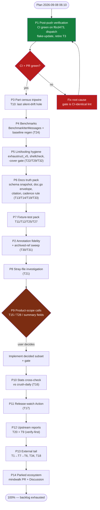

# Pareto Execution Plan — Post-Audit Drift Hardening & Trust Restoration, 2026-09-08 06:10

**Input state:** TODO_LIST.md (T1, T3, T6, T7, T9, T10–T34, Parked) + the
2026-09-08 docs-health audit's findings
(`docs/status/archived/2026-09-08_05-26_docs-health-audit-annotate-archive.md`) +
the ROADMAP "Open questions" entry (summary fields). Head `f6cd473`,
tree clean, **master == origin** (pushed this session).

**Incident context baked into this plan:** minutes before planning, CI was
found RED on all three legs (run 34182840992, goconst ×3) while the local
gate was green — root cause: `nix run .#lint` and CI's
`go tool golangci-lint run` are different binaries. Fixed this session
(`d3bf86f` constants, `f6cd473` gate alignment + gotcha); full gate green
with the CI-identical lint command; real-data tests PASS. The lesson —
"gate must be byte-identical to CI" — shapes tier 1 of this plan.

**Customers of this repo:** downstream consumers (crush-daily, the mindwalk
fork), pkg.go.dev visitors, and the maintainer's future agent sessions.
Value lens: downstream-consumer trust first, drift-sentinel capability
second, internal polish last.

**Zero decision gates pending** — T15/T28/ROADMAP-question are
_user-opinion_ inputs inside P9, not blockers for tiers 1–3.

## Guardrails (VERSCHLIMMBESSERUNG protection — read before executing)

1. **Parity is law:** never touch stats SQL;
   `TestStatsParityWithCrushDailySQL` is the contract (P10 OBSERVES, never
   edits).
2. **No new dependencies** (recorded non-decision).
3. **Gate on the CI-identical lint** (`go tool golangci-lint run
   --timeout=5m ./...`), never `nix run .#lint` alone — the 2026-09-08
   red-CI lesson.
4. **Every gate:** `set -o pipefail; go build ./... && go vet ./... &&
   go test -race -shuffle=on ./... && go tool golangci-lint run
   --timeout=5m ./... && nix flake check && nix develop --command
   actionlint && scripts/check-doc-links.sh`.
5. **Verify-then-annotate:** no "done/green" in any doc before the command
   exited 0 in the same session.
6. **Real-data rule:** after ANY `.go` change, re-run
   `CRUSH_DATA_REAL_DATA_DIR=./.crush go test -run
   'TestSessionsOnRealDatabase|TestAllAPIOnRealDatabase' .`.
7. **Tags need explicit approval.** Pushing commits ≠ pushing tags.

---

## Step 1 — Pareto Breakdown

### The 1% that delivers 51% — prove the pushed state (P1)

The audit diff, the flake-update permissions fix, and the red-CI fix are on
origin but UNPROVEN remotely: CI on `f6cd473` must be observed green on all
legs, `flake-update.yml` must be dispatched to prove the permissions fix
(T3 — its last scheduled run failed), and the PR it opens must be inspected.
One session closes the trust loop for three weeks of work.

### The 4% that delivers 64% — finish the drift sentinel (P3, P4)

- **T10 part-discriminator census tripwire**: the LAST silent-drift hole —
  a new upstream part type today lands in `UnknownPart` without a peep.
  The todos shape has a census tripwire; the parts envelope does not.
- **T24 benchmarks**: the trend CI is blind to `IterMessages` (no
  benchmark exists) and stale against the todos-probe/`UpdatedAt`/ReadFiles
  read-path changes. Regenerate + extend.

### The 20% that delivers 80% — hygiene, docs truth, fixture pins (P2, P5, P6, P7, P8)

- **P2** annotation fidelity + archived-ref sweep (history truthfulness).
- **P5** lint/tooling hygiene: kill the `exhaustruct` deprecation warning
  (T22), shellcheck the guard scripts (T29), refresh stale coverage/bench
  claims (T32).
- **P6** docs truth: storage-schema snapshot doc (T13), parts envelope in
  doc.go (T14), `projects.Register()` citation (T19), docs-health cadence
  rule in AGENTS (T33 — the rule whose absence let a Critical split brain
  live 3 weeks).
- **P7** fixture-test pack: T11/T12/T25/T27 (discovery edge pins).
- **P8** stray-file investigation (T21).

### The other 20% (to 100%) — decisions, upstream, external, parked (P9–P14)

- **P9** product-scope decision bundle (T15 `MissingCapabilities`, T28
  summary-messages semantics, ROADMAP summary-fields exposure) — user
  opinions with prepared evidence.
- **P10** Stats-vs-crush-daily real-data cross-check (T16).
- **P11** release-watch GitHub Action (T17) — automates the AGENTS cadence.
- **P12** upstream reports (T20 ms-comment issue, T9 UnixMilli bug) —
  verify-before-filing, needs go-ahead.
- **P13** external follow-through: T1 Renovate (user UI) → T7 pin actions →
  T6 corpus mining; T34 first scheduled drift run (Mon 2026-09-14); T18
  fuzz cadence per verification session.
- **P14** parked ecosystem: mindwalk PR, crush read-access Discussion.

**Out of scope (ROADMAP non-decisions — do not re-litigate):** in-library
watching, DOMAIN_LANGUAGE.md, AgentGraph CTE (already done — the
non-decision text is historical), stats-SQL rewrite, new dependencies,
config surface, live coverage badge, branch protection.

---

## Step 2 — Comprehensive Plan (medium tasks, 30–100min each)

Sorted by importance → impact → effort → customer value. "When" = what
unblocks it. **All 27 TODO_LIST entries + Parked + the ROADMAP question map
into P1–P14 with zero orphans** (mapping table at the end).

| #   | Task                                                                                                                                                   | Tier     | Impact   | Effort | Customer value                                                                  | When                        |
| --- | ------------------------------------------------------------------------------------------------------------------------------------------------------ | -------- | -------- | ------ | -------------------------------------------------------------------------------- | --------------------------- |
| P1  | **Post-push verification & T3 closure**: observe CI green on `f6cd473` (all legs); dispatch `flake-update.yml`; inspect the PR + vendorHash guard; retire T3 | 1%→51%   | MAX      | 30m    | Three weeks of fixes proven on origin; automation trusted                        | now (push done)             |
| P3  | **T10 part-discriminator census tripwire**: census `{type,data}` kinds over the real registry (env-gated), pin the 8 known discriminators + fail-loud on new ones | 4%→64%   | HIGH     | 90m    | Last silent-drift hole closed; upstream part changes become loud                 | now                         |
| P4  | **T24 benchmarks**: add `BenchmarkIterMessages`; regenerate `baseline-benchmarks.txt` (`-count=6` + benchstat); refresh bench.yml citations          | 4%→64%   | HIGH     | 60m    | Trend CI sees the streaming path; baseline current with new read paths           | now                         |
| P5  | **Lint/tooling hygiene**: T22 `exhaustruct` → `exhaustruct_v5`; T29 shellcheck in devShell + over `scripts/`; T32 `-cover` gate line + refresh FEATURES coverage & bench dates | 20%→80%  | MED-HIGH | 45m    | Clean lint runs; shell scripts statically checked; docs claims fresh             | now                         |
| P6  | **Docs truth pack**: T13 `docs/storage-schema-v0.92.0.md` snapshot; T14 parts envelope + 8 discriminators in `doc.go`; T19 `projects.Register()` sort citation; T33 docs-health cadence rule in AGENTS.md | 20%→80%  | MED-HIGH | 60m    | The reverse-engineered schema documented in-repo; drift audits become scheduled  | now                         |
| P7  | **Fixture-test pack**: T11 `CRUSH_GLOBAL_DATA`-is-a-directory; T12 empty-registry CLI; T25 `last_accessed` UTC round-trip; T27 unknown top-level keys | 20%→80%  | MED      | 75m    | Discovery edges pinned; future upstream registry changes fail loudly            | now                         |
| P2  | **Annotation fidelity + archived-ref sweep**: T30 restore ~15 compressed annotation bodies (or record the accept-decision); T31 archived→archived reference repoint | 20%      | MED      | 45m    | History truthfulness; citations resolve                                          | now (any time)              |
| P8  | **T21 stray-file investigation**: identify the creator of `crush.db?_loc=auto` in `/home/lars/projects/.crush`; trash if safe; document          | 20%      | LOW-MED  | 30m    | Local hygiene; possible upstream tooling bug found                               | now                         |
| P9  | **Product-scope decision bundle**: T15 `MissingCapabilities()` (small API break); T28 summary-messages in day filters/stats; ROADMAP summary-fields exposure (`Session.SummaryMessageID`, `Message.IsSummaryMessage`). Investigate real-data prevalence, present options, implement decided subset | 20%→100% | MED      | 60m+   | API surface decided deliberately, not by drift                                   | **user opinions gate** the implement half |
| P10 | **T16 Stats consumer cross-check**: run this library's `Stats` and crush-daily's collector over the same real DB; require number parity (the contract behind the verbatim-SQL rule) | polish   | MED      | 90m    | Pararity contract proven on production data, not just fixtures                   | post-P6 (snapshot doc helps) |
| P11 | **T17 release-watch Action**: open an issue when a new crush stable lands (drives the AGENTS cadence; weekly drift job already covers scheduled detection) | polish   | MED      | 60m    | Verification cadence automated end-to-end                                        | post-P1                     |
| P12 | **Upstream reports** (needs go-ahead): T20 migration-comments milliseconds-vs-seconds issue; T9 `time.UnixMilli` date bug to openusage + mnemo. Verify-before-filing both | polish   | MED      | 60m    | Ecosystem fixes the census proved; upstream goodwill                             | **go-ahead**                |
| P13 | **External follow-through**: T1 Renovate install (user UI) → T7 pin action SHAs → T6 first corpus-mining pass; T34 observe first scheduled drift run (Mon 2026-09-14); T18 30s fuzz runs per verification session | 20%→80%  | MED      | ext.   | Repo self-maintaining; observation debt cleared                                   | external/schedule            |
| P14 | **Parked ecosystem** (needs go-ahead): mindwalk `sdk/go-crush-data` PR; charmbracelet/crush read-access Discussion post                                                | polish   | MED      | —      | Second/third consumer path opened                                                | **go-ahead**                |

**Totals: 14 medium tasks, ~10.5h** (excluding external waits and
decision-gated implementation).

---

## Step 3 — Micro Breakdown (all tasks ≤12min, grouped by medium task)

Execution order within groups follows Step 2; `→ GATE` = canonical gate (or
the relevant subset for test-only changes) + the real-data rule for any
`.go` change.

### P1 — post-push verification (30m) — now, first

| ID  | Task                                                                            | Min |
| --- | ------------------------------------------------------------------------------- | --- |
| p1.1 | Observe CI on `f6cd473`: all three legs green on origin                          | 10  |
| p1.2 | Dispatch `flake-update.yml` (workflow_dispatch)                                  | 2   |
| p1.3 | Observe the run: green + PR opened on `deps/flake-lock-update`                   | 8   |
| p1.4 | Inspect the PR diff (flake.lock only; vendorHash unchanged → guard consistent)   | 5   |
| p1.5 | Retire T3 in TODO_LIST; note the observation result                              | 5   |

### P3 — part census tripwire (90m) — now

| ID  | Task                                                                            | Min |
| --- | ------------------------------------------------------------------------------- | --- |
| p3.1 | Census harness: env-gated walk over registry messages counting `{type}` kinds    | 12  |
| p3.2 | Run census on the local registry; record the discriminator histogram             | 10  |
| p3.3 | Design tripwire: `TestPartDiscriminatorsCensusShape` (real-registry, env-gated, fail on unknown kind) | 12 |
| p3.4 | Implement + wire next to `TestDecodeTodosCensusShape`                            | 12  |
| p3.5 | Negative test: synthetic new discriminator → tripwire fails loudly               | 10  |
| p3.6 | Count kinds inside `TestAllAPIOnRealDatabase` too (cheap synergy)                | 10  |
| p3.7 | Docs: FEATURES row + AGENTS storage-facts line                                   | 8   |
| p3.8 | → GATE + real-data                                                               | 12  |

P3 executed 2026-09-08 (follow-up session): the final design streams raw
parts rows `ORDER BY rowid DESC` (Go-side parse, payloads as
json.RawMessage) under two ceilings (50k newest rows, 256MiB bytes) — the
SQL-side json_each design died on the 5GB fallback DB (601s timeout), and
the row budget alone could not cap payload I/O. Registry sweep green:
243 databases, 5,223,870 entries, 0 unknown discriminators, 0 unparseable,
14 contention-skips (per-DB 60s timeout + skip-and-log). Root cause of the
hanging DBs: transient contention from a running mindwalk indexer holding
~250 registry DBs open — not a crush bug (TODO_LIST T44 retired). Full gate
green; T10 retired.

### P4 — benchmarks (60m) — now

| ID  | Task                                                                            | Min |
| --- | ------------------------------------------------------------------------------- | --- |
| p4.1 | Write `BenchmarkIterMessages` (mirror `BenchmarkMessages` fixture scale)         | 12  |
| p4.2 | Lint the new file (CI-identical command) + quick test                            | 6   |
| p4.3 | `go test -bench . -count=6 \| tee docs/benchmarks/baseline-benchmarks.txt`       | 12  |
| p4.4 | benchstat parses; sanity-check deltas vs old baseline                            | 8   |
| p4.5 | Update citations (FEATURES row, bench.yml if target list hardcoded)              | 8   |
| p4.6 | → GATE                                                                           | 10  |

### P5 — lint/tooling hygiene (45m) — now

| ID  | Task                                                                            | Min |
| --- | ------------------------------------------------------------------------------- | --- |
| p5.1 | `.golangci.yml`: `exhaustruct` → `exhaustruct_v5` (config + any settings rename) | 10  |
| p5.2 | Verify: CI-identical lint 0 issues AND no deprecation warning in output          | 6   |
| p5.3 | `flake.nix`: add shellcheck to the devShell                                      | 8   |
| p5.4 | Run shellcheck over `scripts/*.sh`; fix findings (or annotate with reasons)      | 10  |
| p5.5 | AGENTS gate line: add `-cover` variant; run it; refresh FEATURES coverage number | 6   |
| p5.6 | FEATURES: refresh bench "observed green" date from P1's run list                 | 5   |

### P6 — docs truth pack (60m) — now

| ID  | Task                                                                            | Min |
| --- | ------------------------------------------------------------------------------- | --- |
| p6.1 | Write `docs/storage-schema-v0.92.0.md` (tables, columns, migrations, verified-at header) | 12 |
| p6.2 | Cross-check against `schema_drift_test.go` guard list (no contradictions)        | 8   |
| p6.3 | `doc.go`: parts envelope `{type,data}` + 8 discriminators paragraph              | 10  |
| p6.4 | `discover.go`: cite upstream `projects.Register()` LastAccessed-desc in dedupe comment | 8 |
| p6.5 | AGENTS.md: docs-health cadence rule (per release + 50+-item sessions)            | 8   |
| p6.6 | → doc-links gate                                                                | 6   |

### P7 — fixture-test pack (75m) — now

| ID  | Task                                                                            | Min |
| --- | ------------------------------------------------------------------------------- | --- |
| p7.1 | T11: `CRUSH_GLOBAL_DATA` points at a directory → upstream `crush.json`-join semantics fixture | 12 |
| p7.2 | T12: fake CLI + empty registry → empty result, no error                          | 10  |
| p7.3 | T25: `last_accessed` UTC round-trip pin (RFC3339Nano → time → re-marshal)        | 10  |
| p7.4 | T27: unknown top-level keys tolerated                                            | 8   |
| p7.5 | Lint each new test file as written (CI-identical command)                        | 8   |
| p7.6 | → GATE subset (build + test + lint)                                             | 10  |

### P2 — annotation fidelity + ref sweep (45m) — any time

| ID  | Task                                                                            | Min |
| --- | ------------------------------------------------------------------------------- | --- |
| p2.1 | Sweep archived files for numbered items without verdict markers (mechanical grep) | 8   |
| p2.2 | Restore 02:13 b)1–3 + c)1–3 bodies from git history (strike + verdict)           | 12  |
| p2.3 | Add per-item verdicts to 08:50 d)1–5 + e)5–10                                    | 10  |
| p2.4 | Restore 04:20 b)-item dropped tails                                              | 8   |
| p2.5 | T31: repoint archived→archived references; re-run doc-links                      | 7   |

### P8 — stray file (30m) — now

| ID  | Task                                                                            | Min |
| --- | ------------------------------------------------------------------------------- | --- |
| p8.1 | Identify creator of `crush.db?_loc=auto` (stat/mtime; correlate with tool runs)  | 12  |
| p8.2 | `trash` it; document finding (AGENTS or the investigating report)                | 8   |
| p8.3 | Retire T21                                                                      | 2   |

### P9 — decision bundle (60m investigation; implementation decision-gated)

| ID  | Task                                                                            | Min |
| --- | ------------------------------------------------------------------------------- | --- |
| p9.1 | Real-data prevalence: how many sessions/messages carry `is_summary_message=1` / `summary_message_id` | 12 |
| p9.2 | Prepare T28 evidence: day-filter behavior with summary rows (query, don't guess)  | 12  |
| p9.3 | Draft the 3 decision options with tradeoffs (T15, T28, ROADMAP question)          | 12  |
| p9.4 | **USER CALL** on each                                                            | —   |
| p9.5 | Implement decided subset (each its own micro pass + gate)                         | 12× |

### P10 — Stats cross-check (90m) — post-P6

| ID  | Task                                                                            | Min |
| --- | ------------------------------------------------------------------------------- | --- |
| p10.1 | Cross-repo harness: run collector + `Stats` over the same real DB                 | 12  |
| p10.2 | Compare aggregates; investigate any delta (session-level vs message-level counts) | 12  |
| p10.3 | Pin parity as an env-gated test or documented recipe                             | 12  |
| p10.4 | Repeat on a second DB (size class diversity)                                     | 10  |
| p10.5 | Record result; retire T16                                                        | 8   |

### P11 — release-watch Action (60m) — post-P1

| ID  | Task                                                                            | Min |
| --- | ------------------------------------------------------------------------------- | --- |
| p11.1 | Workflow: daily `gh release list charmbracelet/crush` vs recorded latest; issue on new stable | 12 |
| p11.2 | Pin action SHAs (consistent with the repo's convention)                          | 8   |
| p11.3 | actionlint + dispatch once; observe the issue-or-noop behavior                   | 12  |
| p11.4 | Wire the recorded-latest state file; retire T17                                  | 10  |

### P12 — upstream reports (60m) — needs go-ahead

| ID  | Task                                                                            | Min |
| --- | ------------------------------------------------------------------------------- | --- |
| p12.1 | T20: verify-before-filing (upstream migrations re-read; claim re-verified)       | 12  |
| p12.2 | File the ms-vs-seconds migration-comment issue                                   | 10  |
| p12.3 | T9: verify the openusage/mnemo `time.UnixMilli` bugs still exist upstream        | 12  |
| p12.4 | File both reports; retire T9/T20                                                 | 10  |

### P13 — external follow-through — external/schedule

| ID  | Task                                                                            | Min |
| --- | ------------------------------------------------------------------------------- | --- |
| p13.1 | T1: install Renovate (user GitHub UI)                                            | 5   |
| p13.2 | T7: after first Renovate PRs, pin/verify action SHAs policy                      | 10  |
| p13.3 | T6: first corpus-mining pass over nightly artifacts                              | 30  |
| p13.4 | T34: observe first scheduled drift run (Mon 2026-09-14 03:47 UTC)                | 5   |
| p13.5 | T18: 30s `go test -fuzz=DecodeParts` + `-fuzz=DecodeTodos` each verification session | 10 |

### P14 — parked ecosystem — needs go-ahead

| ID  | Task                                                                            | Min |
| --- | ------------------------------------------------------------------------------- | --- |
| p14.1 | Push the mindwalk `sdk/go-crush-data` branch PR                                  | —   |
| p14.2 | Post the crush read-access Discussion from the draft                             | —   |

**Totals: 62 micro tasks, 14 medium tasks, ~10.5h.**

---

## Execution graph

Read as priority order, not hard dependencies: P1 is strict (everything
unproven until origin is green); P3→P4 is natural (drift sentinel before
its measurement); P2/P8 float freely; P9's implement-half alone waits on
the user; P12–P14 wait on go-aheads, never on code.

---

## Mapping: TODO_LIST entry → medium task

| TODO_LIST entry                                                                          | →              |
| ----------------------------------------------------------------------------------------- | -------------- |
| External: T1, T3, T34                                                                    | P13, P1, P13   |
| High: T10                                                                                | P3             |
| Medium: T11, T12, T13, T14, T15, T16, T17                                                | P7, P7, P6, P6, P9, P10, P11 |
| Low: T6, T7, T9, T18, T19, T20, T21, T22, T24, T25, T27, T28, T29, T30, T31, T32, T33   | P13, P13, P12, P13, P6, P12, P8, P5, P4, P7, P7, P9, P5, P2, P2, P5, P6 |
| Parked: mindwalk PR, crush Discussion                                                     | P14            |
| ROADMAP open question: summary fields                                                     | P9             |

Every open TODO_LIST entry appears exactly once; no orphans.
